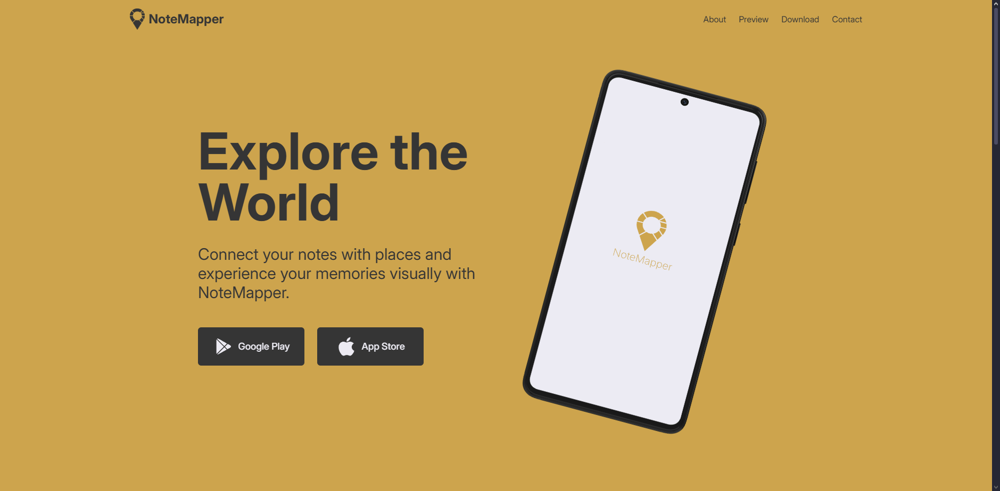

# NoteMapper LP

NoteMapper LP is a modern and responsive landing page for NoteMapper — an app that lets users create and manage notes based on their current location.

## Technologies Used

- **Vite**
- **React**
- **JavaScript**
- **Tailwind CSS**

## Features

- Clean and minimalistic design focused on clarity and user engagement
- Responsive layout optimized for desktop, tablet, and mobile devices
- Parallax scrolling effect for dynamic and appealing visuals
- Clear call-to-action buttons to encourage downloads
- Custom color scheme and typography reflecting the app's brand identity

## Live Demo

Check out the live version here: [NoteMapper](https://notemapper.netlify.app)
